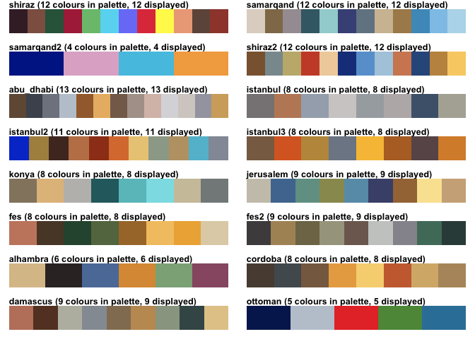
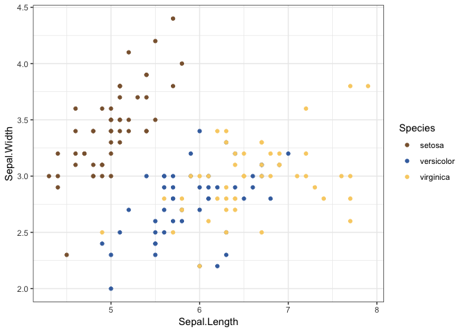
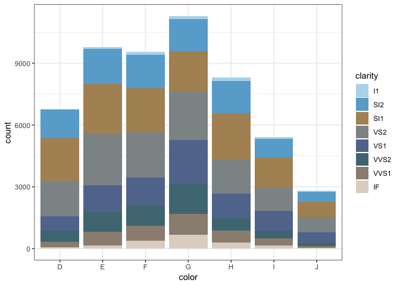
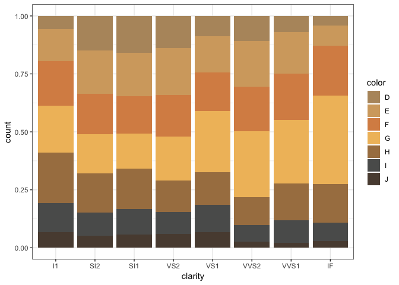
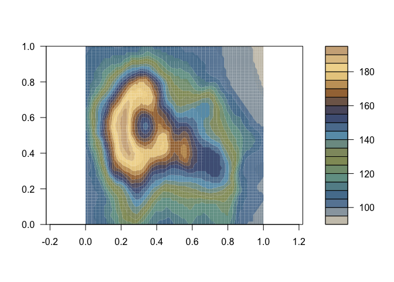

# IslamicArt

This package provides palettes inspired by Islamic art, so is especially
useful for visualizing data about the Islamic world. These palettes
should be used for discrete variables. The colors and ordering of colors
were hand picked to recapitulate the color distribution in the original
art work, so the colors do not reflect numeric values in data and the
visualization may cause confusion if used for continuous data.

This package was also inspired by custom palette packages like
[`ochRe`](https://github.com/ropenscilabs/ochRe) for Australia-inspired
palettes and [`dutchmasters`](https://github.com/EdwinTh/dutchmasters),
palettes derived from 17th century Dutch paintings. I borrowed a lot of
code and documentation from `ochRe`.

## Installation

This package is not yet on CRAN. Install this package with:

``` r
devtools::install_github("lambdamoses/IslamicArt")
```

## Examples

``` r
library(IslamicArt)
library(ggplot2)
theme_set(theme_bw())
```

These are the palettes in this
package:

``` r
viz_palettes(islamic_palettes)
```



``` r
ggplot(iris, aes(Sepal.Length, Sepal.Width, color = Species)) +
  geom_point() +
  scale_color_islamic(palette = "shiraz2")
```



This palette is derived from a Quran manuscript from Shiraz that made
heavy use of gold leaves and blue paint.

``` r
ggplot(diamonds, aes(color, fill = clarity)) +
  geom_bar() +
  scale_fill_islamic(palette = "samarqand")
```



This palette is derived from the blue domes, stone walls, dark blue and
turquoise tiles, and stone floor from Samarqand, Uzbekistan.

``` r
ggplot(diamonds, aes(clarity, fill = color)) +
  geom_bar(position = "fill") +
  scale_fill_islamic(palette = "cordoba")
```



This palette is derived from the horseshoe arches, pillars, and the
mihrab (a niche in mosques facing Mecca) in the Grand Mosque of Cordoba.

``` r
# Do a continuous one anyway
filled.contour(volcano, color.palette = islamic_pal(palette = "jerusalem"), asp = 1)
```



This palette is derived from colors of Dome of the Rock. Here the top of
the volcano is colored like the golden dome, and the lower parts of the
volcano are colored like the blue and green tiles, and the very bottom
of the volcano is colored like the stone floor surrounding Dome of the
Rock.

For color blindness perceptions, see the vignette.
